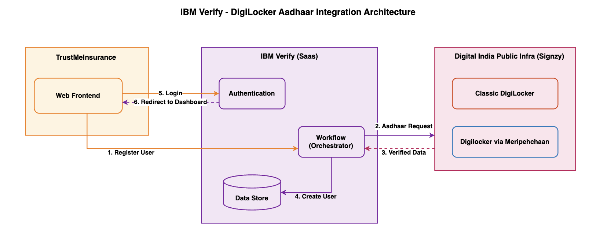

# TrustMe Insurance - User Registration with Aadhaar using IBM Verify Capabilities

This document describes the customizations made to the TrustMe Insurance application to integrate IBM Verify with Aadhaar-based user registration and identity proofing.

## Initial Setup

- **Base Application**: [TrustMe Insurance Sample App](https://github.com/iamdemoing/ci-ciam)
- **Setup Guide**: [Verify Consumer Identity and Access Management](https://ibm.seismic.com/Link/Content/DCFmVpFFfBHJVGFWCWmQ8RMdPQ48)

## Architecture

## Changes Made to the Application

### 1. User Registration Flow

**Modified**: Account creation process to use IBM Verify Flow Designer workflow

- Replaced standard registration form with workflow execution URL
- Integrated Aadhaar-based identity verification through DigiLocker
- Added callback handling for post-registration redirect

### 2. Custom User Attributes

**Added**: DigiLocker profile data storage in user directory

- `digilockerId` - Unique DigiLocker identifier
- `digilockerTimestamp` - Verification timestamp
- `digilockerStatus` - Verification status (verified/pending/failed)
- `dob` - Date of birth from Aadhaar

### 3. Profile Page Enhancement

**Modified**: User profile page to display DigiLocker verification data

- Added identity verification section
- Display DigiLocker ID and verification status
- Show verification timestamp
- Display date of birth from Aadhaar

### 4. IBM Verify Branding Customizations

**Modified**: IBM Verify pages to match TrustMe Insurance branding

#### Login Pages
- Updated logo and color scheme
- Customized background images
- Styled login forms with brand colors
- Added custom footer with company information

#### Email Templates
- Welcome email
- Email verification (OTP)
- Password reset
- Account notifications

#### Password Pages
- Change password page
- Reset password page
- Password strength indicator

#### Workflow Pages
- Custom consent page (validation results)
- Success confirmation page
- Error page with detailed messages

#### User Forms
- Branding customizations to match TrustMe Insurance theme
- Field validations (email format, phone number format, date of birth format)
- Custom helper text and placeholders
- Email and phone verification with OTP

---

**Note**: AI tools were used to assist with code changes and customizations during the implementation.